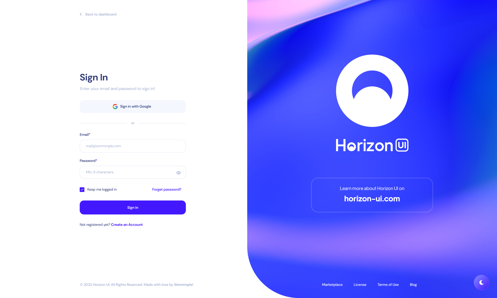
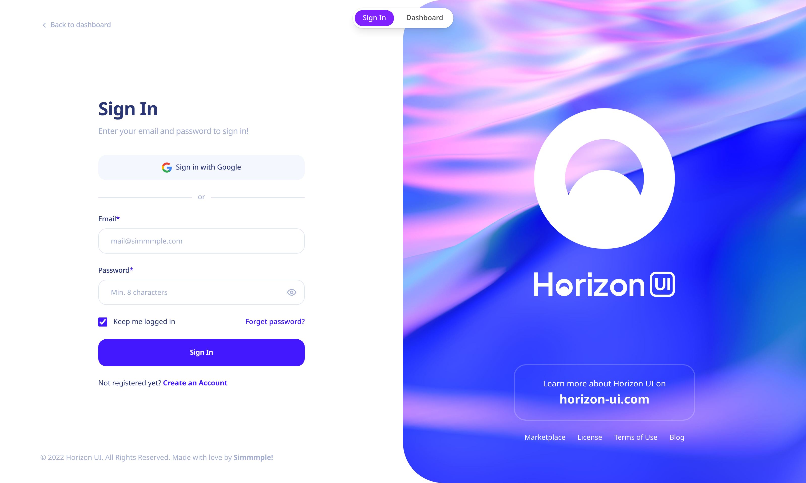
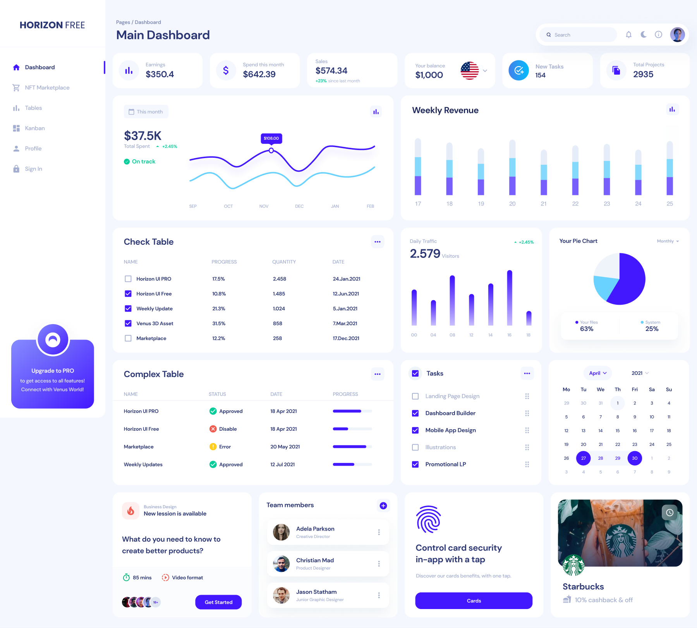
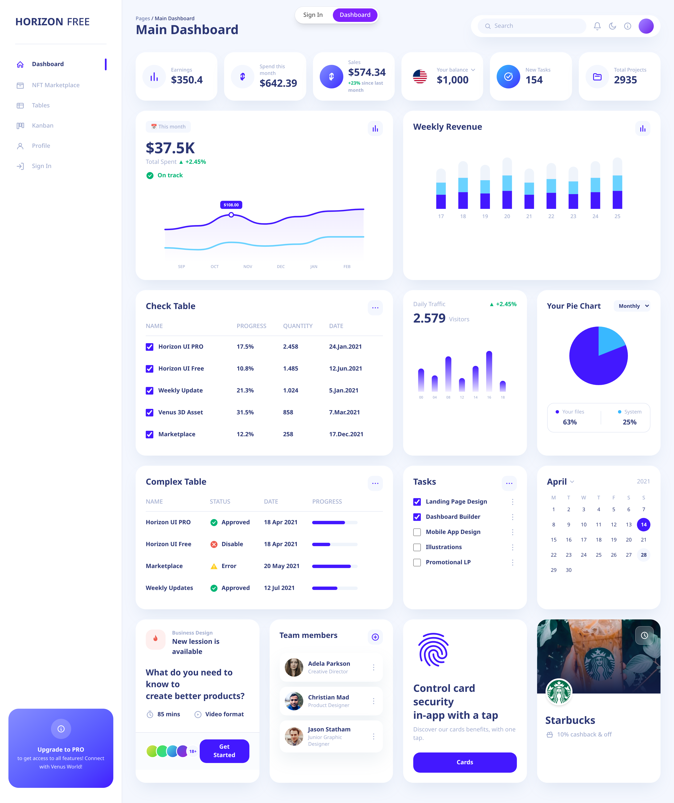

# Figma MCP Benchmark — Horizon UI

A small benchmark of the **official Figma MCP server** against
real open-source design files: take the Community-licensed [Horizon UI Admin
Template](https://horizon-ui.com/) Figma file, run a Design → Code workflow
through the MCP, and show every prompt, every MCP call, and the resulting
code side-by-side with the original render.

> **Why this exists.** "Figma MCP" demos usually show a single hero shot of a
> button or card. This repo runs the same MCP on a real production-grade
> admin template, on **two screens of very different scale**, and records what
> works, what doesn't, and what the actual prompts look like.

---

## TL;DR

| Screen | Figma node | MCP calls used | Result |
| --- | --- | --- | --- |
| **Sign In** | `101:9004` | 2 (`get_design_context`, `get_screenshot`) | [`app/src/screens/SignIn.tsx`](app/src/screens/SignIn.tsx) |
| **Main Dashboard** | `201:1804` | 12 — see breakdown below | [`app/src/screens/Dashboard.tsx`](app/src/screens/Dashboard.tsx) |

**Dashboard breakdown** (3 iterative passes):

1. **Anchor pass** — 3 calls: `get_screenshot` (full page) + `get_design_context` (page-level, returned a "too large" stub with sub-frame IDs) + `get_variable_defs`.
2. **Fidelity pass** — 5 calls of `get_design_context` on the named sub-frames we'd missed: Complex Table, Cashback (Starbucks), Team, Card Security, Course CTA.
3. **Detail pass** — 4 calls of `get_screenshot` on the chart and stat-card sub-frames (This Month, Weekly Revenue, Daily Traffic, the stat-cards row) once we noticed the visualization shapes and icons diverged from Figma.

Total MCP calls for both screens: **14**.
Account: Figma Pro / Full seat (limit: 200 calls/day, 15/min).

### Sign In

| Figma | Result |
| :---: | :---: |
|  |  |

### Main Dashboard

| Figma | Result |
| :---: | :---: |
|  |  |

> The implementation still contains minor differences from the Figma source. None of them affect the UX.

---

## Source design

- Figma file: **Horizon UI — Trendiest Open-Source Admin Template Dashboard**
  (Community).
- Original (Community, read-only) link:
  https://www.figma.com/community/file/1145311259206146009 (search "Horizon UI"
  on Figma Community if the link rots)
- Working copy used in this benchmark:
  `https://www.figma.com/design/m8RclW7pgdyNBGJLv4zkFb/Horizon-UI...?node-id=0-1`
  (duplicated into the author's Figma account — required for MCP access; see
  *Gotchas* below).

Horizon UI ships with a Light Mode dashboard, NFT marketplace, Profile, Tables,
Kanban, and Sign In page. This benchmark touches **Sign In** (small) and **Main
Dashboard** (large) so the two extremes of MCP usage are represented.

---

## Repo layout

```
benchmark/
├── README.md                    ← you are here
├── prompts/                     ← the actual prompts used, one per screen
│   ├── 01-sign-in.md
│   └── 02-dashboard.md
├── screenshots/                 ← Figma render + generated result, side by side
│   ├── figma-sign-in.png
│   ├── result-sign-in.png
│   ├── figma-dashboard.png
│   └── result-dashboard.png
├── tokens/
│   └── tokens.json              ← design tokens extracted from MCP
├── docs/
│   ├── workflow.md              ← the prompting workflow, generalized
│   └── lessons.md               ← gotchas worth knowing before you try this
├── scripts/
│   ├── screenshot.mjs           ← Playwright helper for visual diff (Sign In)
│   └── screenshot-page.mjs      ← Playwright helper for visual diff (Dashboard)
└── app/                         ← Vite + React + TS + Tailwind v4 host project
    └── src/
        ├── assets/              ← assets pulled from MCP asset URLs
        │   ├── bg-gradient.png      (Sign In hero bg)
        │   ├── horizon-logo.svg     (Sign In logo)
        │   ├── google.svg           (Sign In Google button)
        │   ├── avatar-1.jpg, ...    (Dashboard team members)
        │   ├── starbucks-bg.jpg     (Dashboard cashback card)
        │   ├── starbucks-logo.png   (Dashboard cashback card)
        │   └── credit-card.svg      (Dashboard card-security card)
        └── screens/
            ├── SignIn.tsx
            └── Dashboard.tsx
```

---

## Run it locally

```bash
cd app
npm install
npm run dev    # http://localhost:5173
```

---

## The two MCP workflows, contrasted

### Sign In — "transcription" workflow

Small component, MCP returns everything in one shot:

```
get_design_context(fileKey, nodeId="101:9004")
  → React+Tailwind reference code (absolute-positioned)
  → screenshot inline
  → "styles contained in the design" → 5 named colors
  → component metadata (Chakra docs links for Button, Checkbox, Icon)
  → asset URLs for gradient bg, logo, Google icon, eye icon, etc.

get_screenshot(fileKey, nodeId="101:9004", maxDimension=1600)
  → downloadable PNG of the rendered design (for the README)
```

Human work: rewrite the absolute-positioned reference into a maintainable
`grid + flex` layout, download the asset URLs (which expire in 7 days), and
fix one quirky SVG (`preserveAspectRatio="none"` + `fill="var(--fill-0, white)"`
both confuse the browser). See [`prompts/01-sign-in.md`](prompts/01-sign-in.md)
for the full walkthrough.

### Main Dashboard — "screenshot first, drill where it's wrong"

Large screen, MCP can't return the whole tree:

```
# Pass 1 — anchor & first draft
get_screenshot(fileKey, nodeId="201:1804", maxDimension=1800)
  → 1800x1624 PNG — visual ground truth.

get_design_context(fileKey, nodeId="201:1804", excludeScreenshot=true)
  → "Output too large (64.8KB)" — MCP returns sparse metadata XML
    listing every sub-frame ID by name (Large_Complex Table,
    Medium_Team, Medium_Cashback, Medium_Safety, Medium_Course CTA, …).

get_variable_defs(fileKey, nodeId="201:1804")
  → {"Secondary/Grey/300":"#F4F7FE"}
  → reuse the token palette from Sign In.

# Pass 2 — fidelity fix: diff first draft against screenshot,
# drill into the sub-frames we got wrong (5 more calls):
get_design_context(fileKey, nodeId="201:1971")   # Complex Table
get_design_context(fileKey, nodeId="201:2079")   # Cashback (Starbucks)
get_design_context(fileKey, nodeId="201:2049")   # Team members
get_design_context(fileKey, nodeId="201:2071")   # Card security
get_design_context(fileKey, nodeId="201:2028")   # Course CTA

# Pass 3 — detail fix: visualizations and icons still didn't match.
# Pull screenshots of each chart and the full stat-cards row, then
# hand-roll SVG visuals that mirror what we see (4 more calls):
get_screenshot(fileKey, nodeId="201:1835")       # This Month line chart
get_screenshot(fileKey, nodeId="201:1866")       # Weekly Revenue tri-color stacked bars
get_screenshot(fileKey, nodeId="201:1918")       # Daily Traffic gradient bars
get_screenshot(fileKey, nodeId="201:1809")       # Stat cards row — identify the 6 icons
```

Human work: compose the page semantically from the screenshot, then diff
against the Figma render and drill into the specific sub-frames whose detail
(exact column labels, status icon set, progress-bar widths, exact copy on the
bottom cards) needs to be 1:1. See
[`prompts/02-dashboard.md`](prompts/02-dashboard.md).

### The takeaway

The MCP is **great** at:
- design tokens (colors, spacing values, type sizes)
- per-component code + screenshot
- asset extraction (URLs to PNG/SVG, valid for 7 days)
- Code Connect mapping (not exercised here)

The MCP is **not** a "give me the page" tool. For anything bigger than a
single component, treat the MCP as a *reference oracle* — it tells you what
the design is made of, you write the layout.

---

## Gotchas (read this before you try the same on your file)


1. **Asset URLs expire in ~7 days.** `curl -o` them to disk the moment you
   get them, otherwise your prompt is non-reproducible.
2. **Asset URLs lie about file format.** `imgHorizonLogo` came back as an
   `.svg`, not the `.png` we'd guessed from the variable name. Always `file
   <path>` before using.
3. **Big screens fail `get_design_context`.** When the response would exceed
   the context limit, MCP returns a "too large" stub and tells you to drill
   into sublayers. For a 30-frame dashboard that's 8+ calls; using the
   screenshot is usually faster.

More background in [`docs/lessons.md`](docs/lessons.md).

---

## Fidelity note

The implementation contains minor visual differences from the Figma source. None of them affect the UX.

---

## License

The Horizon UI design file is © Simmmple, distributed via Figma Community
under their terms. This repo contains no copyrighted Figma assets bigger than
the Sign In gradient and Horizon logo — both shipped only as references inside
`app/src/assets/` for the benchmark to render. Code in this repo is MIT.
